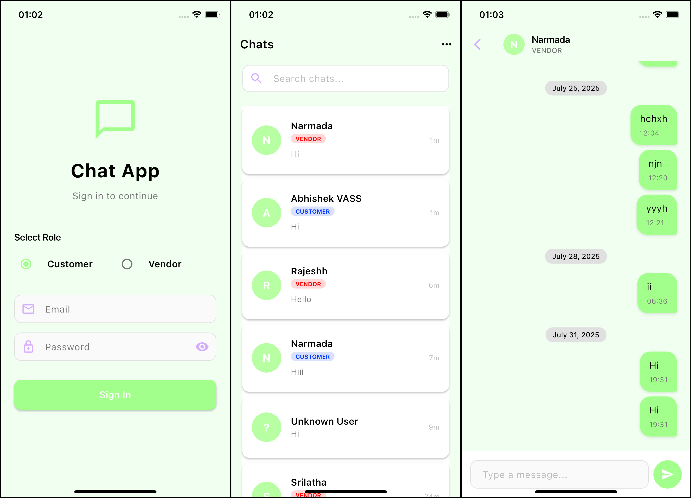

# Chat App

A modern Flutter-based chat application with real-time messaging capabilities, featuring a clean UI with role-based authentication (Customer/Vendor).

## Screenshots



## Features

- **Role-based Authentication**: Sign in as either Customer or Vendor
- **Real-time Messaging**: Instant message delivery using WebSocket connections
- **Chat List Management**: View and search through all conversations
- **Modern UI**: Clean design with light green and white color scheme
- **Message History**: Organized conversations with date separators
- **Search Functionality**: Find specific chats quickly

## Prerequisites

Before running this project, make sure you have the following installed:

- **Flutter SDK** (version 3.0.0 or higher)
- **Dart SDK** (comes with Flutter)
- **Android Studio** or **VS Code** with Flutter extensions
- **Android SDK** (for Android development)
- **Xcode** (for iOS development, macOS only)
- **Git**

## Installation & Setup

### 1. Clone the Repository

```bash
git clone <repository-url>
cd chat_app
```

### 2. Install Dependencies

```bash
flutter pub get
```

### 3. Platform-specific Setup

#### For Android:
- Ensure Android SDK is properly configured
- Connect an Android device or start an emulator

#### For iOS (macOS only):
- Install Xcode from the App Store
- Open the project in Xcode and configure signing
- Run `cd ios && pod install` to install iOS dependencies

### 4. Environment Configuration

Create a `.env` file in the root directory with your API configuration:

```env
API_BASE_URL=your_api_base_url_here
SOCKET_URL=your_websocket_url_here
```

## Running the Project

### Development Mode

```bash
# Run in debug mode
flutter run

# Run on specific device (if multiple devices connected)
flutter run -d <device-id>

# Run with hot reload enabled
flutter run --hot
```

### Build for Production

#### Android APK:
```bash
flutter build apk --release
```

#### Android App Bundle:
```bash
flutter build appbundle --release
```

#### iOS:
```bash
flutter build ios --release
```

### Running Tests

```bash
# Run all tests
flutter test

# Run tests with coverage
flutter test --coverage
```

## Project Structure

```
lib/
├── core/                    # Core functionality
│   ├── config/             # App configuration
│   ├── di/                 # Dependency injection
│   ├── error/              # Error handling
│   ├── models/             # Data models
│   ├── network/            # Network layer
│   ├── services/           # Core services
│   ├── theme/              # App theming
│   └── utils/              # Utility functions
├── features/               # Feature modules
│   ├── auth/               # Authentication feature
│   │   ├── data/           # Data layer
│   │   ├── domain/         # Business logic
│   │   └── presentation/   # UI layer
│   └── chat/               # Chat feature
│       ├── data/           # Data layer
│       ├── domain/         # Business logic
│       └── presentation/   # UI layer
└── main.dart               # App entry point
```

## Architecture

This project follows Clean Architecture principles with:

- **Presentation Layer**: BLoC pattern for state management
- **Domain Layer**: Business logic and use cases
- **Data Layer**: Repository pattern with API and local storage
- **Core**: Shared utilities, services, and configurations

## Dependencies

Key dependencies used in this project:

- **flutter_bloc**: State management
- **dio**: HTTP client for API calls
- **socket_io_client**: Real-time messaging
- **shared_preferences**: Local storage
- **get_it**: Dependency injection

## Troubleshooting

### Common Issues

1. **Flutter not found**: Ensure Flutter is in your PATH
2. **Dependencies not found**: Run `flutter pub get`
3. **iOS build issues**: Run `cd ios && pod install`
4. **Android build issues**: Clean and rebuild with `flutter clean && flutter pub get`

### Debug Commands

```bash
# Check Flutter installation
flutter doctor

# Clean project
flutter clean

# Get dependencies
flutter pub get

# Analyze code
flutter analyze
```